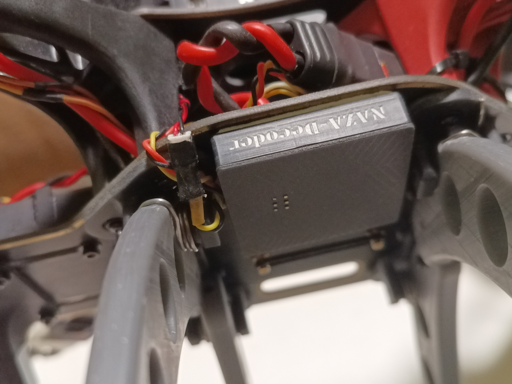
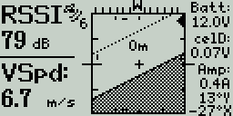
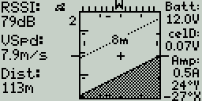
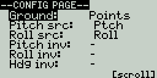
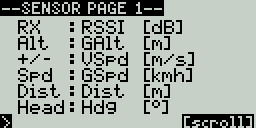
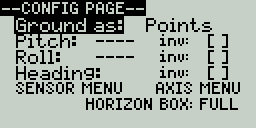
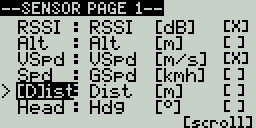
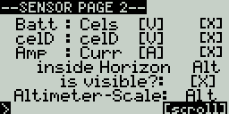
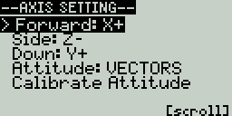
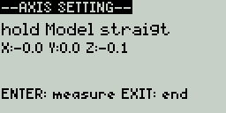

## Naza-M V1/V2 to FrSky SmartPort Telemetrie Bridge - Arduino
-  source code: [frittna/NazaDecoder---S.Port-Telemetrie-Bridge](https://github.com/frittna/NazaDecoder---S.Port-Telemetrie-Bridge)  @ 2.Okt.2026 
  
-> integriert alle GPS-Daten und das Kompass-Heading vom DJI Naza-M V1/V2 in den FrSky SmartPort Telemetrie-Datenkanal S.Port.

-> verwendet NazaDecoder Bibliothek [dalmirdasilva/ArduinoNazaDecoder](https://github.com/dalmirdasilva/ArduinoNazaDecoder) und FrSkySportTelemetry Bibiliothek [FrSkySportTelemetry](https://github.com/marhar/FrSkySportTelemetry)

-> automatisch gefundene Sensoren: Latitude, Longitude, Altitude, Speed, Heading, Timestamp, Satellites*, FixType*

*)Die Satellitenanzahl und GPSFix-Type welche im FrSky GPS-Paket nicht vorgesehen sind werden mit Hilfswerten des Standartsensors RPM (enthält auch T1+T2) übertragen. 
RPM selbst kann später gelöscht werden. T1+T2 einfach in "Sats" und GFix" umbenennen.

### Hardware

- Arduino mit ATMega328P 5V (hier in Form eines zweckentfremdeten alten S-OSD/iOSD REMZIBI Moduls mit Atmega328P darauf, es wird aber mit jedem Arduino 328P/328PB laufen)
- Es wird nur ein HW-Serial Eingang für das GPS-Singal und ein SW-Serial Port Ausgang für die SPort übertragung gebraucht. Evtl. ein LED-Ausgang.
- Somit ist bei anderer Hardware nur die Pinbelegung des Ein-/Ausgangs anzupassen und evtl. die Einstellungen für den Programmer in Arduino bzw bevorzugte Art es zu flashen.

### Anschlüsse

  In meinem Fall:
- Atmega328P Pin PD7: über R1k Widerstand zu SmartPort Leitung führen ("CH3 In THRO" auf meinem S-OSD Modul). 
- Atmega328P Pin PD0: Serial-RX-Pin (PD0 / RXD) zum NAZA<->GPS Kabel-TX führen (Pin 2 orange, neben 1 GND schwarz).
- 1x Status LED nach Wahl ("gültiges Paket erkannt"): Atmega328P Pin13/PB1 -> 9 in Ardiuono! (am S-OSD Modul: "F1-In"-PIN mit passendem Vorwiderstand über LED nach Masse führen)
- Wenn jemand wie ich dieses umprogrammierte S-ODS Modul verwendet, nicht das GPS wie sonst vorgesehen durch das Modul schleifen. Die Pins des "to GPS" und "to LED" vom Bild des Moduls sind nicht 1:1 durchverbunden.
- Es muss also vom GPS-Kabel eine einfache Anzapfung für TX und GND gemacht werden, oder viel schöner ist einen Passthrough Stecker aus den ausgelöteten Stecker und Pins basteln die man alle nicht mehr braucht.
- #########
- OPTIONAL: ich einen 3.3V zu 5V Pegelwandler für das serielle GPS-TX-Signal(3.3V) zum Arduino(5V) eingebaut. Also 3.3V aus kleinem Fix-Regler und 5V in den Levelshifter, dessen LV1 zu GPS(TX) und HV1 zu PD7(Pin30).
- #########
- OPTIONAL: MPU-6000-Senor Anschluß per I²C -> dazu passt auch mein LUA Skript horz.lua. Siehe Anleitung weiter unten
- #########

### Programmierung des Ardiono bei Atmega328P
- Arduino IDE: Werkzeuge -> Board -> "Arduino Pro or Mini Pro" -> Processor: 16Mhz 5V -> Programmer -> STK 500 dev. -> Sketch -> Programmer upload (Strg+Shift+U)
- ÜBER ISP-KABEL AM ISP ANSCHLUSS -> BOOT BUTTON AM MODUL WÄHREND FLASHEN FEST GEDRÜCKT HALTEN.
- Der Atmega283P hat nur EINE serielle Schnittstelle, aktives GPS und serieller Monitor zum testen gleichzeitig nicht möglich.

### LUA Script Anleitung - Lageanzeige und Telemetie Display Skript - für SmartPort Sender wie Taranis QX9 EdgeTX @ 2.11.7 (und kompatible)
--
`horz.lua` bietet im Menü die Quellen `ANGLES` (Empfängerwerte `Ptch`/`Roll`) und `VECTOR` (normierte `AccX/Y/Z`). Im Vektormodus sind `fwd`, `side` und `down` samt Vorzeichen einstellbar; `Calibrate` ermittelt zuerst die Schwerkraftachse und danach durch Nase-abwärts-Neigen die Vorwärtsachse.

Für den seitlich montierten Archer passen als Startwert `fwd=X+`, `side=Z-`, `down=Y+`: Nase abwärts ergibt `AccX+`, rechts unten `AccZ+`, und unten ist `AccY+`. 
Bei Verwendung des Gyro-Arduino-Sketches diese Lua-Achsen im Menü auf `fwd=X+`, `side=Y+`, `down=Z-` einstellen; das ist nicht die Archer-Voreinstellung. Pitch/Roll werden nicht mit Rohachsen vermischt; Heading bleibt `Hdg` von der Naza.

Im Sensor-Menü schalten `+/-` bei Slot-Quellen durch den Katalog; der Drehgeber bearbeitet einzelne Zeichen.
Kurzes ENTER springt beim Bearbeiten durch die Zeichen; ENTER halten überspringt das aktuelle Feld und führt direkt zum nächsten.

Auf Sensorseite 2 lässt sich `Altimeter-Scale` separat und manuell eingeben (Standard `Alt`); diese Quelle steuert in beiden Ansichten die 2,5-m-/5-m-Höhenstriche am linken Boxrand. Auf Seite 4 (`Axis Settings`) schaltet `View` standardmäßig auf die kompakte 3D-Lageansicht in derselben Box um; `Attitude` wählt die Lagequelle und `Calibrate` startet die Vektorkalibrierung.
3D-View zeigt dezente, beidseitige Skalen 45°-/90°-Lagen; die Kompassleiste und der gefüllte Home-Pfeil bleiben erhalten. `View` kann jederzeit auf die bisherige Horizontansicht zurückgestellt werden. Der 3D-Modus funktioniert auch mit den korrigierten `Ptch`/`Roll`-Werten (`ANGLES`); Rohwerte aller drei Beschleunigungsachsen werden nur im `VECTOR`-Modus benötigt.

Die Anzeige in der Horizontmitte lässt sich auf Menüseite 3 unter `inside Horizon` auf einen Katalogsensor umstellen und mit `is visible?` abschalten. Standardmäßig ist sie aktiv und zeigt `Alt`.

Neben der Satellitenzahl zeigt die Hauptansicht ein 10×10-Pixelsymbol: ohne GPS-Fix werden Symbol und Zahl ausgeblendet, ab Fix 1 blinkt die Satellitenbasis, bei 2D/3D-Fix kommen Signalstrahlen hinzu. Nach mehr als 10 Sekunden stabilem 3D-Fix blinkt das Symbol bei einem Einbruch auf Fix 2 oder darunter (länger als 3 Sekunden) eine Minute lang.

Der Home-Pfeil wird beim ersten gültigen 3D-Fix nach Lua-Start aus der GPS-Position gesetzt und zeigt relativ zum `Hdg` zur Startposition. Die Richtung wird innerhalb der sichtbaren Kompassskala markiert, außerhalb weist ein Pfeil am linken oder rechten Rand in die passende Richtung. Unter 5 m Abstand wird er wegen GPS-Positionsrauschen ausgeblendet; nach einem Lua-Neustart wird Home neu gesetzt.

Der optionale MPU-Gyro-Sketch wartet nach dem Einschalten 25 Sekunden, bevor er MPU-Daten liest. Danach mittelt er für etwa eine Sekunde den Gyro-Offset; das Modell muss während dieser Messung ruhig stehen. Die Lage wird anschließend aus der tatsächlichen Beschleunigungsrichtung initialisiert – eine schräge Einschaltlage wird nicht als Nulllage abgezogen.

-3D view:

 

-Classic view

-Menu pages (Settings)

