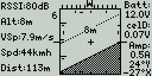
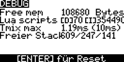

## Naza-M V1/V2 to FrSky SmartPort Telemetry Bridge - Arduino + EDGE-TX LUA SCRIPT
- **Project Site:** https://github.com @ Oct 10, 2026

- -> runterscrollen für detusch - scroll down for german <--

- Integrates all GPS data and compass heading from the DJI Naza-M V1/V2 into the native FrSky SmartPort (S.Port) telemetry data channel.
- Uses the NazaDecoder library [dalmirdasilva/ArduinoNazaDecoder](https://github.com) and the FrSkySportTelemetry library [FrSkySportTelemetry](https://github.com).
- **Automatically discovered sensors:** Latitude, Longitude, Altitude, Speed, Heading, Timestamp, Satellites\*, FixType\*  
*\*Note: Satellite count and GPS Fix Type are not natively supported in the standard FrSky GPS packet. They are transmitted using auxiliary values via the standard RPM sensor slot (which also contains T1+T2). The RPM sensor itself can be deleted later. Simply rename T1+T2 to "Sats" and "GFix" in your transmitter.*

### Hardware

- **Arduino with ATMega328P 5V:** (This project originally used a repurposed old S-OSD/iOSD REMZIBI module with an onboard Atmega328P, but it will work perfectly fine with any generic Arduino 328P/328PB).
- Requires only one hardware serial input for the GPS signal and one software serial output for the S.Port transmission. An optional LED output can also be used.
- If you use different hardware, you only need to adjust the input/output pin definitions and your preferred programming/flashing settings in the Arduino IDE.

### Wiring / Connections

In my configuration:
- **Atmega328P Pin PD7:** Connect to the SmartPort line via a 1kΩ resistor ("CH3 In THRO" on my S-OSD module).
- **Atmega328P Pin PD0:** Serial RX Pin (PD0 / RXD) connects to the NAZA <-> GPS cable TX line (Pin 2, orange wire next to Pin 1 GND, black).
- **1x Optional Status LED ("Valid Packet Detected"):** Atmega328P Pin 13 / PB1 -> digital Pin 9 in Arduino. (On the S-OSD module: Route the "F1-In" pin to ground through a matching current-limiting resistor and LED).
- **Crucial Note for S-OSD Modules:** If you are repurposing an S-OSD module like me, **do not** loop the GPS signal through the module as originally intended. The "to GPS" and "to LED" pins shown on the module's layout diagram are not directly connected; the internal traces differ from the original reference board.
- You must create a simple tap-off connection for TX and GND directly from the GPS cable. Alternatively, you can desolder unused pins/connectors to build a clean passthrough adapter.
- **OPTIONAL:** For peace of mind, I added a 3.3V to 5V logic level converter for the serial GPS TX signal (3.3V) leading to the Arduino RX (5V). This utilizes a small 3.3V fixed regulator and a level shifter (LV1 to GPS TX, HV1 to Arduino RX).
- **OPTIONAL:** MPU-6000 sensor connection via I²C. This layout integrates directly with my `horz.lua` script. See the LUA script configuration guide below.

### Arduino Programming (Atmega328P)
- **Arduino IDE Settings:** Tools -> Board -> "Arduino Pro or Mini" -> Processor: 16MHz 5V -> Programmer -> STK 500 dev -> Sketch -> Upload Using Programmer (`Ctrl+Shift+U`).
- **When using an ISP cable on the ISP header:** Hold down the BOOT button on the module firmly while flashing.
- *Note:* The Atmega328P has only ONE hardware serial interface. You cannot run the active GPS feed and the serial monitor for debugging at the same time.

---

---

### LUA Script Manual - Attitude & Telemetry Display Script
*Designed for SmartPort Transmitters running EdgeTX @ 2.11.7 or compatible (e.g., Taranis QX7)*

#### Installation
1. Copy all three files (`horz.lua`, `horz_menu.lua`, and `horz_cfg.lua`) into the same folder on your transmitter SD card: `/SCRIPTS/TELEMETRY/`.
2. In your telemetry screen setup page, select only `horz.lua` as the active telemetry script.

#### CONFIG MENU
- `Ground View`: Toggle the ground visualization style between dots, lines, or solid white.
- `PITCH/ROLL`: Source adjustments can only be configured in Angle Mode. Otherwise, pitch, roll, and heading can be inverted here.
- `HORIZON BOX`: Choose between `FULL` and `LITE`. The Lite mode switches to a simplified, less resource-intensive calculation method for the horizon box boundaries.

#### SENSOR MENU
- Ensure you know the exact names of your telemetry sensors on your radio. In the script's sensor menu, map the sensor `Name` to its corresponding source (`Src`).
- Standard telemetry sensors can be instantly assigned from a scrollable preset list, which auto-fills their units and precision values.
- If a custom sensor is missing from the presets, navigate to page 3 of the sensor menu to register custom entries along with custom units and precision variables.
- **Menu Columns:** `Prec` controls the number of decimal points, `MM` defines a Min/Max threshold value, and the checkbox toggles layout visibility.
- The UI automatically scales down the screen layout (which is quite challenging on monochrome displays) based on whether you display 6 or fewer sensors on the left panel.
- A miniature real-time graph appears if only a single sensor is active on the left sidebar (and the graph checkbox remains enabled in the Config Menu).
- **Threshold Alerts:** If the sensor value moves past the boundary set in `MM`, the current value will appear inverted on the left side while continuing to stream live data. The graph line transitions into a dotted pattern during this state.
- If no custom Min/Max thresholds are configured, the UI simply tracks and displays the session's absolute Min/Max values.
- Disabling the graph causes the single sensor field to display the session minima and maxima text values instead. The horizontal X-axis time window is fully adjustable between 10s and 999s.
- `inside Horizon`: Allows you to display a single floating telemetry value (value + unit only) centered inside the artificial horizon disk. It can be hidden entirely using its visibility checkbox.

#### AXIS MENU
- Select your orientation data input type under `ATTITUDE`.
  - `ANGLES`: Uses standard receiver-calculated angle telemetry (typically `Ptch`/`Roll`).
  - `VECTOR`: Uses normalized accelerometer telemetry (`AccX/Y/Z`). In vector mode, the `fwd`, `side`, and `down` orientations and signs are manually adjustable.
- `Calibrate`: Automatically zeroes out the current orientation offset, provided the correct attitude input type is active.
- *Insight:* A stabilized FrSky receiver generally outputs pre-calculated `Angles`. Separate MPU modules or flight controllers typically output raw or semi-processed gravity `Vectors` (spatial paths where absolute gravity shifts influence the angles). It appears FrSky blends these values internally using their `AccZ` data stream.

#### HORIZON BOX
- `Altimeter-Scale` (Defaults to `Alt`): Adjusts the step increments for the vertical 2.5m / 5m altitude lines on the left side of the horizon container.
- **Home Arrow:** Locks your home coordinates at the first valid 3D GPS fix after the LUA script boots. It displays a dynamic home arrow pointing back toward the launch pad relative to your current heading (`Hdg`). This target tracking indicator is rendered directly onto the visible compass tape.
- **3D View Environment:** Draws distinct dotted attitude indicators at ±45° pitches and dashed reference bars at ±90° limits. The top compass tape also places a dedicated home marker directly onto the sliding scale.
- **Satellite Indicator Widget:** A 10×10px satellite icon sits next to the satellite count on the left.
  - **No Fix:** The icon and text collapse and vanish.
  - **Fix Available:** The base satellite icon begins to flash.
  - **2D/3D Fix:** Dynamic signal waves appear around the icon.
  - **Signal Degradation:** If a solid 3D fix drops back down to a 2D fix, the satellite icon flashes an alert state for 60 seconds, even if the connection restores back to a 3D state during that window.

---

### UI Screenshots & Documentation Gallery

 

---

#########################################################################
#######################################################################
######################################################################
#####################################################################

---

## Naza-M V1/V2 to FrSky SmartPort Telemetrie Bridge - Arduino + EDGE-TX LUA SCRIPT
-  Project Site: https://github.com/frittna/NazaDecoder-S.Port-Telemetrie-Bridge-MPU @ 10.Okt.2026 

- integriert alle GPS-Daten und das Kompass-Heading vom DJI Naza-M V1/V2 in den nativen FrSky SmartPort Telemetrie-Datenkanal S.Port.

- verwendet NazaDecoder Bibliothek [dalmirdasilva/ArduinoNazaDecoder](https://github.com/dalmirdasilva/ArduinoNazaDecoder) und FrSkySportTelemetry Bibiliothek [FrSkySportTelemetry](https://github.com/marhar/FrSkySportTelemetry)

- automatisch gefundene Sensoren: Latitude, Longitude, Altitude, Speed, Heading, Timestamp, Satellites*, FixType*
*)Die Satellitenanzahl und GPSFix-Type welche im FrSky GPS-Paket nicht vorgesehen sind werden mit Hilfswerten des Standartsensors RPM (enthält auch T1+T2) übertragen. 
RPM selbst kann später gelöscht werden. T1+T2 einfach in "Sats" und GFix" umbenennen.fg

### Hardware

- Arduino mit ATMega328P 5V (hier in Form eines zweckentfremdeten alten S-OSD/iOSD REMZIBI Moduls mit Atmega328P darauf, es wird aber mit jedem Arduino 328P/328PB laufen)
- Es wird nur ein HW-Serial Eingang für das GPS-Singal und ein SW-Serial Port Ausgang für die SPort übertragung gebraucht. Evtl. ein LED-Ausgang.
- Somit ist bei anderer Hardware nur die Pinbelegung des Ein-/Ausgangs anzupassen und evtl. die Einstellungen für den Programmer in Arduino bzw bevorzugte Art es zu flashen.

### Anschlüsse

  In meinem Fall:
- Atmega328P Pin PD7: über R1k Widerstand zu SmartPort Leitung führen ("CH3 In THRO" auf meinem S-OSD Modul). 
- Atmega328P Pin PD0: Serial-RX-Pin (PD0 / RXD) zum NAZA<->GPS Kabel-TX führen (Pin 2 orange, neben 1 GND schwarz).
- 1x Status LED nach Wahl ("gültiges Paket erkannt"): Atmega328P Pin13/PB1 -> 9 in Ardiuono! (am S-OSD Modul: "F1-In"-PIN mit passendem Vorwiderstand über LED nach Masse führen)
- Wenn jemand wie ich dieses umprogrammierte S-ODS Modul verwendet, nicht das GPS wie sonst vorgesehen durch das Modul schleifen. Die Pins des "to GPS" und "to LED" vom Bild des Moduls sind nicht direkt verbunden; die interne Verkabelung ist nicht dieselbe wie beim Original-Board.
- Es muss also vom GPS-Kabel eine einfache Anzapfung für TX und GND gemacht werden, oder viel schöner ist einen Passthrough-Stecker aus den ausgelöteten Stecker und Pins basteln, die man nicht mehr braucht.
- #########
- OPTIONAL: ich habe mir sicherheitshalber einen 3.3V->5V Pegelwandler für das serielle GPS-TX-Signal(3.3V) zum Arduino(5V) eingebaut. Also 3.3V aus kleinem Fix-Regler und 5V in den Levelshifter, mit LV1 zu GPS(TX) und HV1 zu Arduino RX.
- #########
- OPTIONAL: MPU-6000-Senor Anschluß per I²C -> dazu passt auch mein LUA Skript `horz.lua` -> Siehe Anleitung weiter unten im Text..
- #########

### Programmierung des Ardiono bei Atmega328P
- Arduino IDE: Werkzeuge -> Board -> "Arduino Pro or Mini Pro" -> Processor: 16Mhz 5V -> Programmer -> STK 500 dev. -> Sketch -> Programmer upload (Strg+Shift+U)
- ÜBER ISP-KABEL AM ISP ANSCHLUSS -> BOOT BUTTON AM MODUL WÄHREND FLASHEN FEST GEDRÜCKT HALTEN.
- Der Atmega283P hat nur EINE serielle Schnittstelle, aktives GPS und serieller Monitor zum testen gleichzeitig nicht möglich.

---------------------------

---------------------------
### LUA Script Anleitung - Lageanzeige und Telemetie Display Skript - für SmartPort Sender wie Taranis QX9 EdgeTX @ 2.11.7 (und kompatible)
- Dateien / Installation: Alle drei Dateien `horz.lua`, `horz_menu.lua` und `horz_cfg.lua` in denselben Ordner `/SCRIPTS/TELEMETRY/` auf den Sender kopieren.
- Im Screen-Setup wird nur `horz.lua` als Telemetrie-Skript ausgewählt.

### CONFIG MENU
-- `Ground View`: Zeigt Boden als Punkte, Linien oder in weiß
-- `PITCH/ROLL` Source kann nur im Angle-Modus ungestellt werden* , ansonst können diese hier samt Heading invertiert werden.
-- `HORIZON BOX`: FULL/LITE - Lite schaltet auf eine primitivere Berecnungsart der Horizontbox um.

### SENSOR MENU
- Vorher sollte man alle seine Sensornamen vom Sender namentlich 100% kennen und nun im Skipt Menü bei Sensors `Name` und die Quelle `Src` auswählen.
- Sensoren die eher Standaratsensoren sind, können gleich aus der scrollbaren Liste samt Einheit und Präzision zugewiesen werden.
- Wenn ein Sensor nicht in der Liste ist, kann man auf Seite 3 des Sensor-Menüs eigene Sensoren in die Liste eintragen, mit Einheit Präzision.
- Sensorspalte `Prec` ist für die Anzahl der Kommastellen, `MM` für einen MIN/MAX Schwellwert und die Checkbox für die Sichtbarkeit.
- Je nachdem ob auf der Linken Sensorseite 6 oder weniger Werte angezeigt werden, wird versucht die Darstellung auf den Display (ein Krampf) anzupasen.
- Den kleinen Graphen sieht man wenn nur einen Sensor auf der linken Seite aktiv ist (und die Checkbox im Config Menü nicht aus ist).
- Darauf erscheint der aktuelle Wert links invertiert sobald er über oder unter der bei `MM` eingestellten Grenzen liegt und zeigt den Wert weiterhin an. Im Chart ist die Linie dann punktiert.
- Wenn für Sensoren keine MinMax Werte gespeichert wurden, wird einfach das akt. Min/Max der Session angezeigt.
- Ist der Graph deaktiviert, zeigt das Feld mit nur einem Sensorwert stattdessen die Session-Minima und -Maximma. Die Graph X-Time ist einstellbar (10–999s).
- In Horizontmitte lässt sich ein Sensorwert (nur Wert+Einheit) unter `inside Horizon` einstellen und mit Checkbox auch unsichtbar zu machen.
 
### AXIS MENU
- Hier wählt man unter anderem die Art der Lagedaten - `ATTITUDE:` ANGLES (Empfängerwerte meist `Ptch`/`Roll`) oder `VECTOR` (normierte `AccX/Y/Z`). Im Vektormodus sind `fwd`, `side` und `down` samt Vorzeichen einstellbar.
-  `Calibrate` setzt die Ausrichtung automatisch wenn die Eingabeart die richtige gewählt wurde.
-  Ein Frsky Gyro-Empänger liefert mir zb. Angles, der MPU und andere Lagesensoren / FlightController vermutlich auch meist Vektoren, also die Richtungen im Raum und keine Winklel wo die Schwerkraft nicht mitbestimmt.
  (Frsky diese das aber mit ihrer AccZ trotzdem kombiniert meiner Vermutung nach)

### HORIZONT BOX
- `Altimeter-Scale` (Standard `Alt`) steuert die 2,5-m-/5-m-Höhenstriche links an der Horizontbox.
- Der Home-Pfeil wird beim ersten gültigen 3D-Fix nach Lua-Start aus der GPS-Position gesetzt und zeigt relativ zum `Hdg` zur Startposition. Die Richtung wird innerhalb der sichtbaren Kompassskala markiert.
- 3D-View zeigt gepunktete Lage-Linien bei ±45° und gestrichelte Linien bei ±90°; Kompassleiste zeigt auch Homeposition mittels Pfeil auf der Leiste.

- Links der Box wird die Satellitenzahl angezeigt und ein 10×10px großes Satelliten Symbol: ohne GPS-Fix werden Symbol und Zahl ausgeblendet, ab Fix 1 blinkt die Satellitenbasis, bei 2D/3D-Fix kommen Signalstrahlen hinzu.
- Ist ein gültiger 3DFix bereits gefunden und geht auf 2D zurück blinkt der Satellit für 60Sekunden nach, auch wenn wieder auf 3D hochschaltet.

-- Beispiel Bilder: siehe oben
